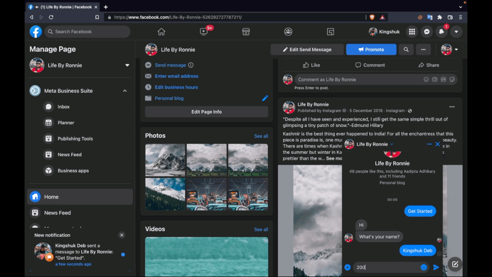

# Facebook Messenger Bot

# Working :

- Says Hi on entering the Chat.
- Asks for your name.
- Asks for your birth date.
- Asks if the user wants to find out how many days till his next birthday. [The bot accepts ("yes", "yeah", "yup", "no”, "nah", etc) as replies]
- The REST endpoints are /messages, /messages/:id, /summary, respectively

# DEMO VIDEO
<a href="https://youtu.be/pMHDWzZmZNE" title="AdaKerja Assignment Video Demo">
  <p align="center">
    
  </p>
</a>

# GIF SNIPPETS

## Click on Get Started


## Provide Your Name

## Provide Your Birth Date

## Answer with a negetion/validation


## REST API Endpoint for all messages

## REST API Endpoint for a particular messages

## REST API Endpoint for all user data


Made with [BootBot CLI](https://github.com/Charca/bootbot-cli)

# Runnig on Local Machine

```
sudo npm i bootbot-cli
```

```
npm install
```

```
npm start
```

# Packages & Tech Used :

- Bootbot
- Express
- Mongoose
- Shortid

```
Before starting initialise your env values in .env & bootbot config variables in config/default.json file
```

```javascript
// Initialise .env
MONGO_USERNAME=YOUR_MONGO_USERNAME
MONGO_PASSWORD=YOUR_MONGO_PASSWORD
MONGO_DBNAME=YOUR_MONGO_DBNAME
PORT=YOUR_PORT
```

```javascript
// Initialise config/default.json For BootBot Variables
{
  "accessToken": "YOUR_FACEBOOK_PAGE_ACCESS_TOKEN",
  "verifyToken": "YOUR_FACEBOOK_PAGE_VERIFY_TOKEN",
  "appSecret": "YOUR_FACEBOOK_APP_SECRET",
  "botPort": "YOUR_BOT_PORT", // Withut "" Integer
  "botTunnelSubDomain": "YOUR_BOT_LOCALTUNNEL_DOMAIN_NAME"
} 
```

```
It currently runs locally only as the Facebook App is not yet published
```
